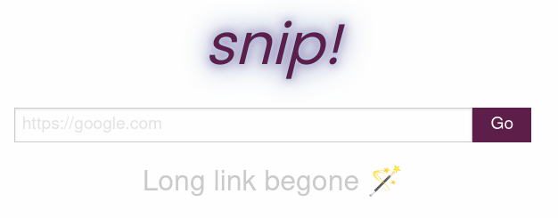

# Snip
[](https://drone.friedl.net/incubator/snip)

No-fuzz link shortener.



## Getting started
Snip is a self-hosted link shortener. It provides an API and a web interface.
Dependencies are managed with [pipenv](https://pipenv.pypa.io/en/latest/) and
[npm](https://www.npmjs.com/). Snip runs on
[flask](https://flask.palletsprojects.com/) the frontend is assembled with
[webpack](https://webpack.js.org/). All this is rather simple in practice.

### Run from docker
The simplest way to get started is to run snip from the regularily [published
docker containers](https://hub.docker.com/repository/docker/arminfriedl/snip).

```shell
docker run -p5000 -e"SNIP_FLASK_SECRET=secretkey" arminfriedl/snip:latest
```

Then navigate your browser to http://localhost:5000. Alternatively, you can also
query the REST API. For an example see the [querysheet.http](querysheet.http) in
this repository. If you want to run it manually you can also install snip and
its dependencies yourself.

Per default the container is configured with the following settings
```
SNIP_DATABASE="sqlite"
SNIP_DATABASE_URI="sqlite:////data/snip.db"
SNIP_FLASK_HOST="0.0.0.0"
# SNIP_FLASK_PORT=5000 (default)
```

You can mount an external folder under `/data` to persist all operational data
of snip across restarts of the container.

### Install and Run manually
While docker is convenient you may want to build and run snip yourself. E.g. for
development or because you need special settings.

#### Install Dependencies
To install the dependencies for snip, you need
[pipenv](https://pipenv.pypa.io/en/latest/) and [npm](https://www.npmjs.com/)
installed on your system. Then run:

```shell
pipenv install --dev
npm install --dev
```

#### Configure
Snip provides a couple of configuration options. For details see
[config.py::SnipConfig](snip/config.py). An example configuration for local
development is provided in [.snipenv.local](.snipenv.local). Adapt the
configuration to your needs.

You can also specify another stage in [.snipenv](.snipenv) by setting the
variable `SNIP_STAGE=[stage]`. The configuration will then be read from
`.snipenv.[stage]`.

#### Build the Snip Frontend
The snip backend itself needs no separate build step. However, the frontend
needs to be assembled by webpack.


```shell
# Run a development build with continuous update
npm run watch

# Run a production build
npm run publish
```

#### Run Snip
From the repository root run:

```shell
export SNIP_STAGE=local # or any other stage
pipenv run python -m snip
```

Flask will tell you where you can reach snip, per default http://localhost:5000.

# Contribute
If you want to contribute to `snip` feel free to send patches to
dev[at]friedl[dot]net. Alternatviely, you can issue a pull request on GitHub
which will be cherry picked into my tree. If you plan significant long-term
contributions drop me a mail for access to the incubator repository.

# Github Users
If you are visiting this repository on GitHub, you are on a mirror of
https://git.friedl.net/incubator/snip. This mirror is regularily updated
with my other GitHub mirrors.

Like with my other incubator projects, once I consider `snip` reasonable
stable the main tree will move to GitHub.
